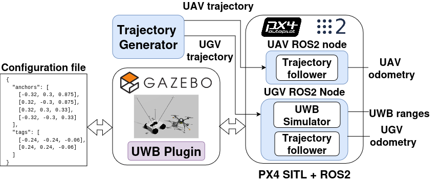

# UWBPX4Sim

A ready-to-use Ultra-Wideband simulator for relative localization of multi-robot teams integrated with ROS 2, Gazebo Harmonic and PX4 SITL. This is a standalone repo that is complementary to the work [Radio-based Multi-Robot Odometry and Relative Localization](https://github.com/amartinezsilva/mr-radio-localization?tab=readme-ov-file), containing all simulation-based tools used in the main work.

It includes:

- Modified Gazebo models for the `x500` UAV and the `r1_rover` UGV with onboard UWB tags / anchors
- World files and helper scripts for generating layouts and bridge configurations
- Our custom Gazebo plugin `UWBGazeboPlugin`
- The `setup_simulator.sh` guided setup script that installs the plugin/models into PX4 and syncs plugin parameters, in one command (see [Quick start: automated setup](#quick-start-automated-setup))
- The `simulator_launcher.sh` tmux launcher used to launch all nodes involved in the experiment in a clean and organized manner
- A `ROS2` specific folder with the `px4_sim_offboard` ROS 2 package used to bridge Gazebo/PX4 topics and run the control-side nodes, as well as the GZ-to-ROS 2 bridge configuration in `ROS2/px4_sim_offboard/config/uwb_bridge.yaml` (**NOTE**: this file is automatically generated as part of the setup, the existing file is just a sample. See below the instruction to set up the experiments).

## Repository layout

- `models/base_models/`: template UAV and UGV models used as the generation inputs
- `models/custom_models/`: auto-generated per-robot UAV and UGV models with the desired UWB transceiver layouts
- `ROS2/`: ROS 2 assets directory
- `ROS2/px4_sim_offboard/`: ROS 2 package for the PX4/Gazebo bridge and offboard-side nodes
- `ROS2/px4_sim_offboard/config/uwb_bridge.yaml`: generated GZ-to-ROS 2 bridge topics for all anchor-tag pairs
- `config/`: layout YAML files used for model generation and simulator spawning
- `setup_simulator.sh`: guided setup script (models, plugin, plugin parameters, optional world, optional PX4 rebuild, ROS 2 workspace checks)
- `simulator_launcher.sh`: tmux-based PX4 SITL launcher
- `uwb_gazebo_plugin/`: custom Gazebo system plugin source
- `uwb_gazebo_plugin/params.yaml`: plugin tuning parameters, the single source of truth applied by `setup_simulator.sh`
- `worlds/`: Gazebo worlds used in the experiments
- `tools/`: helper scripts for sensor layout and mesh generation



## Prerequisites and dependencies

This repository is intended for the PX4/Gazebo SITL workflow. The simulation side has been tested with **Ubuntu 24.04 LTS**, **ROS 2 Jazzy** and **Gazebo Harmonic**:

Before using `UWBPX4Sim`, make sure the following are installed:

- [ROS 2 Jazzy](https://docs.ros.org/en/jazzy/index.html)
- [Gazebo Harmonic](https://gazebosim.org/docs/harmonic/ros_installation/)
- [PX4 toolchain](https://docs.px4.io/main/en/dev_setup/dev_env_linux_ubuntu.html)
- [QGroundControl](https://docs.qgroundcontrol.com/master/en/qgc-user-guide/releases/daily_builds.html)
- [Micro XRCE-DDS Agent and Client](https://docs.px4.io/main/en/ros2/user_guide.html#setup-micro-xrce-dds-agent-client)
- [tmux](https://github.com/tmux/tmux/wiki/Installing)
- The `eliko_messages` ROS 2 package from [`eliko_ros`](https://github.com/robotics-upo/eliko_ros), required by the UGV offboard node to publish aggregated UWB range messages.

If you are unsure whether your PX4/ROS 2/Gazebo setup is healthy, it is worth first testing the PX4 [multi-vehicle](https://docs.px4.io/main/en/sim_gazebo_gz/multi_vehicle_simulation) Gazebo example before trying out this plugin.


## What the plugin does

For each UGV anchor and UAV tag pair, the plugin publishes:

- a ground-truth range topic
- a simulated range topic with dropout and additive noise

The simulated model includes:

- LOS degradation as a function of distance
- NLOS degradation as a function of effective blocked thickness along the line of sight
- Blocked thickness measured directly from world obstacle intersections
- Optional persistent pair bias
- One-sided stochastic NLOS noise, so NLOS tends to overestimate range rather than underestimate it
- Blockage contribution from robot bodies themselves, capped so it cannot by itself exceed Soft NLOS

The NLOS model lets the user tune:

- LOS / Soft NLOS / Hard NLOS / blackout boundaries
- dropout range and standard-deviation range
- how much faster Hard NLOS degrades than Soft NLOS
- how much more important thickness is than distance in NLOS

The simulated and ground truth ranges for each anchor-tag pair are published as custom Gazebo topics following this criteria:

- `/uwb_gz_simulator/distances/aItJ`
- `/uwb_gz_simulator/distances_ground_truth/aItJ`

where `aItJ` denotes anchor `I` and tag `J`.

## Plugin parameters

The plugin accepts the following parameters. Rather than editing them directly in PX4's `server.config`, edit `uwb_gazebo_plugin/params.yaml` (a plain `key: value` file, one entry per parameter below) and re-run `./setup_simulator.sh` -- it re-syncs the `<plugin>` block in `server.config` from that file every time it runs, so `params.yaml` stays the single source of truth. See [Quick start: automated setup](#quick-start-automated-setup).

| Parameter | Meaning | Default value |
| --- | --- | --- |
| `topic` | Base topic for simulated ranges | `/uwb_gz_simulator/distances` |
| `ground_truth_topic` | Base topic for ground-truth ranges | `/uwb_gz_simulator/distances_ground_truth` |
| `gaussian_noise_mean_cm` | Mean additive offset in cm | `0.0` |
| `apply_pair_bias` | Enables persistent per-pair bias | `false` |
| `bias_min_cm` | Minimum persistent pair bias in cm | `-27.0` |
| `bias_max_cm` | Maximum persistent pair bias in cm | `20.0` |
| `enable_nlos_dropout` | Enables NLOS-aware degradation logic | `true` |
| `nlos_endpoint_margin_m` | Ignores tiny intersections near the line-of-sight endpoints | `0.02` |
| `los_dropout_start_distance_m` | LOS distance where dropout begins to rise | `10.0` |
| `los_dropout_end_distance_m` | LOS distance where modeled dropout reaches its maximum pre-blackout value | `70.0` |
| `los_hard_dropout_distance_m` | LOS distance above which complete blackout is enforced | `75.0` |
| `los_max_thickness_m` | Maximum blocked thickness still treated as LOS | `0.10` |
| `soft_nlos_max_thickness_m` | Upper blocked-thickness bound for Soft NLOS | `0.50` |
| `blackout_thickness_m` | Blocked-thickness threshold for complete blackout | `1.0` |
| `hard_nlos_gap_ratio` | Extra Hard-NLOS slope relative to Soft NLOS (`0 = same slope`, `1 = double slope`) | `0.50` |
| `min_dropout_probability` | Minimum dropout probability | `0.02` |
| `max_dropout_probability` | Maximum dropout probability before blackout | `0.90` |
| `min_noise_stddev_cm` | Minimum noise standard deviation in cm | `12.0` |
| `max_noise_stddev_cm` | Maximum noise standard deviation in cm | `50.0` |
| `los_stddev_start_distance_m` | LOS distance where the stddev begins to rise | `15.0` |
| `los_stddev_end_distance_m` | LOS distance where the stddev reaches its maximum | `75.0` |
| `nlos_dropout_thickness_extra_weight` | Extra thickness importance for dropout relative to the fixed distance baseline (`0 = equal`, `1 = twice as influential`) | `0.50` |
| `nlos_stddev_thickness_extra_weight` | Extra thickness importance for stddev relative to the fixed distance baseline (`0 = equal`, `1 = twice as influential`) | `0.50` |


## Quick start: automated setup

`setup_simulator.sh` automates everything described in [1. Setting up the experiment](#1-setting-up-the-experiment) and [2. Setting up the plugin in PX4 SITL](#2-setting-up-the-plugin-in-px4-sitl) below: generating models and the ROS 2 bridge config from a layout YAML, copying the models and plugin into your PX4 checkout, registering the plugin in PX4's build and `server.config` (with parameters synced from `uwb_gazebo_plugin/params.yaml`), optionally installing a custom world, optionally rebuilding PX4, and checking the ROS 2 workspace side. It is safe to re-run any time -- re-running never duplicates entries and only touches files that actually changed.

From the repository root:

```bash
./setup_simulator.sh
```

Run with no arguments, it walks you through everything interactively: if you don't pass `--layout`, it lists the YAML files in `config/` and asks you to pick one; the world to use comes from that layout's own `world:` field (see below), or `--world`, or -- if neither is set -- it lists the `.sdf` files in `worlds/` and asks you to pick one (plus a "none" option); and it asks before doing anything slow or destructive, like rebuilding PX4 (`make px4_sitl`) or running `colcon build`.

Every `.sdf` file under `worlds/` is copied into PX4 on every run regardless of which one ends up selected, so any of them -- and any world PX4 already ships (e.g. `baylands`) -- can be named by `world:`/`--world`; an unrecognized name falls back to PX4's default world with a warning.

Common options:

```bash
./setup_simulator.sh --layout config/demo_nlos.yaml                        # use a specific layout, skip the picker
./setup_simulator.sh --px4-dir /path/to/PX4-Autopilot --ros-ws /path/to/ros_ws   # non-default locations
./setup_simulator.sh -y                                                     # non-interactive, safe defaults (skips optional world/rebuild unless also given --build/--world)
./setup_simulator.sh -n                                                     # dry run: print what would happen, change nothing
./setup_simulator.sh --help                                                 # full flag reference
```

Re-run it whenever you:

- change the layout YAML (add/remove robots, move sensors)
- edit `uwb_gazebo_plugin/params.yaml` to retune the plugin's NLOS/noise model
- point it at a freshly cloned PX4 checkout that doesn't have the plugin yet

After it finishes, it prints the exact `export` commands and the `./simulator_launcher.sh` invocation to launch the simulation (see [4. Running the simulation](#4-running-the-simulation)).

The sections below document what the script does step by step, and remain useful as a manual fallback or for troubleshooting.

## 1. Setting up the experiment

**Note**: `setup_simulator.sh` runs this step for you (including an interactive layout picker) as part of the [automated setup](#quick-start-automated-setup). Read on if you want to run the underlying tool yourself, or to understand the layout YAML schema.

We provide a tool to set up all PX4 and ROS2 simulation assets from a single `yaml` configuration file in the `config` folder. 
The experiment layout YAML is used to tell the simulator:

- number of robots (UGVs and UAVs) and spawning position of each in the world coordinates
- the number and positions of anchors and tags mounted on each robot
- the offboard control parameters used for each robot

From the repository root:

```bash
python3 tools/configure_uwb_layout.py --layout config/demo_nlos.yaml
```

This generates:

- one rover model per UGV, under `models/custom_models/r1_rover_<id>/`
- one UAV model per UAV, under `models/custom_models/x500_<id>/`
- The GZ/ROS2 bridge description file for your customized setup in `ROS2/px4_sim_offboard/config/uwb_bridge.yaml`

The script must be executed in order to 1) create a layout for the first time, 2) modify the sensor layout in any of the robots, or 3) add or remove robots from the simulation.

Besides `uavs`/`ugvs`, the layout also accepts a top-level `world` field naming the Gazebo world to use -- either a custom one from `worlds/*.sdf`, or one PX4 already ships (e.g. `baylands`). `setup_simulator.sh` resolves it by name against PX4's own worlds directory after copying every custom world there (see [Quick start: automated setup](#quick-start-automated-setup)); an unrecognized name, or omitting the field, falls back to PX4's default world. `--world` overrides it.

```yaml
world: walls_nlos
uavs:
  - id: 0
    ...
```

The layout YAML is structured robot-by-robot. Each vehicle entry contains:

- `spawn_pose`: a 6-vector `[x, y, z, roll, pitch, yaw]` in world coordinates
- `offboard`: the ROS/offboard parameters for that specific robot
- `tags` or `anchors`: the sensor placement relative to the robot body

This same YAML is used both:

- by `configure_uwb_layout.py` to generate models and the bridge config
- by `offboard_launch.py` to derive the ROS 2 node parameters at launch time

For example, the following four-robot layout assigns the same per-vehicle sensor geometry to two UAVs and two UGVs, while keeping anchor and tag ids globally unique:

```yaml
uavs:
  - id: 0
    spawn_pose: [3.0, 0.0, 0.0, 0.0, 0.0, 1.57079632679]
    offboard:
      trajectory_csv_file: trajectory_lemniscate_uav.csv
      lookahead_distance: 2.0
      cruise_speed: 0.5
      odom_error_position: 0.0
      odom_error_angle: 0.0
    tags:
      - id: 1
        position: [-0.24, -0.24, -0.06]
      - id: 2
        position: [0.24, 0.24, -0.06]

  - id: 1
    spawn_pose: [3.0, -5.0, 0.0, 0.0, 0.0, 1.57079632679]
    offboard:
      trajectory_csv_file: trajectory_lemniscate_uav.csv
      lookahead_distance: 2.0
      cruise_speed: 0.5
      odom_error_position: 0.0
      odom_error_angle: 0.0
    tags:
      - id: 3
        position: [-0.24, -0.24, -0.06]
      - id: 4
        position: [0.24, 0.24, -0.06]

ugvs:
  - id: 0
    spawn_pose: [0.0, 0.0, 0.0, 0.0, 0.0, 1.57079632679]
    offboard:
      trajectory_csv_file: trajectory_lemniscate_agv.csv
      lookahead_distance: 2.0
      cruise_speed: 0.52
      odom_error_position: 0.0
      odom_error_angle: 0.0
    anchors:
      - id: 1
        position: [-0.32, 0.3, 0.875]
      - id: 2
        position: [0.32, -0.3, 0.875]
      - id: 3
        position: [0.32, 0.3, 0.33]
      - id: 4
        position: [-0.32, -0.3, 0.33]

  - id: 1
    spawn_pose: [0.0, -5.0, 0.0, 0.0, 0.0, 1.57079632679]
    offboard:
      trajectory_csv_file: trajectory_lemniscate_agv.csv
      lookahead_distance: 2.0
      cruise_speed: 0.52
      odom_error_position: 0.0
      odom_error_angle: 0.0
    anchors:
      - id: 5
        position: [-0.32, 0.3, 0.875]
      - id: 6
        position: [0.32, -0.3, 0.875]
      - id: 7
        position: [0.32, 0.3, 0.33]
      - id: 8
        position: [-0.32, -0.3, 0.33]
```

Rules:

- UAV and UGV ids are integers matching the Gazebo/PX4 model suffix (`x500_0`, `r1_rover_0`, ...).
- `spawn_pose` is expressed as `[x, y, z, roll, pitch, yaw]` in world coordinates and is used by `simulator_launcher.sh`.
- Anchor ids are globally unique across all UGVs, and Tag ids are globally unique across all UAVs.
- Pair topics appear encoded as `aItJ` for anchor I and tag J, so `a1t2` is globally unique by construction.

#### Layout parameters description

| Key | Meaning |
| --- | --- |
| `uavs` | List of UAV definitions. Each entry generates one `x500_<id>` model and one `uav_offboard_control_<id>` node. |
| `ugvs` | List of UGV definitions. Each entry generates one `r1_rover_<id>` model and one `agv_offboard_control_<id>` node. |
| `id` | Integer robot id. It becomes part of the model name, frame prefix, and node name. Example: `id: 0` produces `x500_0` or `r1_rover_0`. |
| `spawn_pose` | World-frame robot spawn pose as `[x, y, z, roll, pitch, yaw]`. The launcher uses this to spawn the robot in Gazebo. The offboard nodes also use it as the origin that maps local trajectory coordinates into world coordinates. |
| `tags` | For UAVs only. List of mounted UWB tags. |
| `anchors` | For UGVs only. List of mounted UWB anchors. |
| `offboard` | Per-robot ROS 2 / PX4 offboard control parameters. See below for a full description.|

Each entry under `tags:` or `anchors:` has the same structure:

- `id` : Global integer sensor id. Tag ids must be unique across all UAVs, and anchor ids must be unique across all UGVs.
- `position` : Sensor position relative to the robot `base_link`, as `[x, y, z]` in the robot model frame.

#### Offboard parameters

These keys are accepted for both UAVs and UGVs.

| Key | Meaning | Default |
| --- | --- | --- |
| `trajectory_csv_file` | CSV trajectory file name under `ROS2/px4_sim_offboard/trajectories/`. The controller loads this path and tracks it. | `trajectory_lemniscate_uav.csv` for UAVs, `trajectory_lemniscate_agv.csv` for UGVs |
| `lookahead_distance` | Lookahead distance in meters used to pick a future target point on the trajectory. | `2.0` |
| `cruise_speed` | Nominal tracking speed in m/s used by the offboard controller. | `0.5` for UAVs, `0.52` for UGVs |
| `odom_error_position` | Synthetic odometry drift percentage applied to translational motion. `1.0` means about 1 m drift per 100 m traveled. | `0.0` |
| `odom_error_angle` | Synthetic odometry drift percentage applied to heading increments. | `0.0` |
| `ros_odometry_topic` | ROS topic where the node publishes noisy odometry. | `/<frame_prefix>/odom` |
| `ros_gt_topic` | ROS topic where the node publishes ground-truth pose. | `/<frame_prefix>/gt` |
| `frame_prefix` | Prefix used for ROS TF frames and default ROS topic naming. | `uav_<id>` or `ugv_<id>` |
| `marker_array_topic` | ROS topic for the ground-truth marker trail. | `/<frame_prefix>/gt_marker_array` |
| `world_frame_id` | Name of the world/map frame used for GT pose and TF publishing. | `map` |

#### Eliko aggregated measurements

The UGV additionally publishes an aggregated list of UWB ranges using `eliko_messages/msg/DistancesList` from the [`eliko_ros`](https://github.com/robotics-upo/eliko_ros) repository. This is done for integration in the use case scenario of "Radio-based Multi-Robot Odometry and Relative Localization" where the UGV hosts the UWB server, in order to be consistent with the real experiment setup. If you are not going to use this setup, you can ignore this topic and use the generic pair topics.

| Key | Meaning | Default |
| --- | --- | --- |
| `distances_list_topic` | Aggregated UWB range-list topic published by the UGV node. | `/<frame_prefix>/eliko/Distances` |


## 2. Setting up the plugin in PX4 SITL

**Note**: `setup_simulator.sh` automates every step below (including syncing plugin parameters from `uwb_gazebo_plugin/params.yaml`, idempotently) as part of the [automated setup](#quick-start-automated-setup). Read on if you want to do it by hand, or to understand what the script is doing.

1. Copy the generated model folders from `models/custom_models/` into:

```text
<PX4-Autopilot>/Tools/simulation/gz/models/
```

2. Copy `uwb_gazebo_plugin/` into:

```text
<PX4-Autopilot>/src/modules/simulation/gz_plugins/
```

**NOTE**: `COLCON_IGNORE` only tells ROS 2 / `colcon` not to treat the PX4 Gazebo plugin as a ROS package.
PX4 does not use this file, so copying it into PX4 is harmless, but excluding it keeps the PX4 tree cleaner.

3. Register the plugin in the PX4 top-level `CMakeLists.txt`:

```cmake
add_subdirectory(uwb_gazebo_plugin)
add_custom_target(px4_gz_plugins ALL DEPENDS OpticalFlowSystem MovingPlatformController TemplatePlugin GenericMotorModelPlugin BuoyancySystemPlugin SpacecraftThrusterModelPlugin UWBGazeboPlugin)
```

4. Add the plugin instance to:

```text
<PX4-Autopilot>/src/modules/simulation/gz_bridge/server.config
```

The parameter values inside the block come from `uwb_gazebo_plugin/params.yaml` -- edit that file (see [Plugin parameters](#plugin-parameters)) rather than hand-editing this block, since `setup_simulator.sh` overwrites it from `params.yaml` on every run. The block below shows the current defaults, for reference / manual setup:

```xml
<plugin entity_name="*" entity_type="world" filename="libUWBGazeboPlugin.so" name="custom::UWBGazeboSystem">
  <topic>/uwb_gz_simulator/distances</topic>
  <ground_truth_topic>/uwb_gz_simulator/distances_ground_truth</ground_truth_topic>

  <gaussian_noise_mean_cm>0.0</gaussian_noise_mean_cm>

  <apply_pair_bias>false</apply_pair_bias>
  <bias_min_cm>-27.0</bias_min_cm>
  <bias_max_cm>20.0</bias_max_cm>

  <enable_nlos_dropout>true</enable_nlos_dropout>
  <nlos_endpoint_margin_m>0.02</nlos_endpoint_margin_m>

  <los_dropout_start_distance_m>10.0</los_dropout_start_distance_m>
  <los_dropout_end_distance_m>70.0</los_dropout_end_distance_m>
  <los_hard_dropout_distance_m>75.0</los_hard_dropout_distance_m>

  <los_max_thickness_m>0.10</los_max_thickness_m>
  <soft_nlos_max_thickness_m>0.50</soft_nlos_max_thickness_m>
  <blackout_thickness_m>1.0</blackout_thickness_m>
  <hard_nlos_gap_ratio>0.75</hard_nlos_gap_ratio>

  <min_dropout_probability>0.02</min_dropout_probability>
  <max_dropout_probability>0.90</max_dropout_probability>

  <min_noise_stddev_cm>12.0</min_noise_stddev_cm>
  <max_noise_stddev_cm>50.0</max_noise_stddev_cm>
  <los_stddev_start_distance_m>15.0</los_stddev_start_distance_m>
  <los_stddev_end_distance_m>75.0</los_stddev_end_distance_m>

  <nlos_dropout_thickness_extra_weight>0.5</nlos_dropout_thickness_extra_weight>
  <nlos_stddev_thickness_extra_weight>0.5</nlos_stddev_thickness_extra_weight>
</plugin>
```

5. (**OPTIONAL**) If you want to run the experiment with a custom world instead of the ones provided by PX4 (such as the ``walls_nlos.sdf`` file available in this repository in the ``worlds`` folder), make sure to copy your ``.sdf`` file to the following path (`setup_simulator.sh` does this for every file under `worlds/` automatically -- see [Quick start: automated setup](#quick-start-automated-setup) -- so this manual copy is only needed if you're doing this step by hand):

```text
<PX4-Autopilot>/Tools/simulation/gz/worlds/
```

6. Rebuild PX4:

```bash
cd <PX4-Autopilot>
make px4_sitl
```

#### How to spawn the robots?

`spawn_pose` tells Gazebo where to spawn the robot and defines the world-frame origin of that robot’s local trajectory file

For example, if a UAV uses:

```yaml
spawn_pose: [3.0, 0.0, 0.0, 0.0, 0.0, 1.57079632679]
```

and the first trajectory CSV point is:

```text
x=0.5, y=-0.5, z=2.0
```

then the offboard node interprets that trajectory point in the robot-local ENU frame and transforms it into the world frame using that `spawn_pose`.

## 3. ROS 2 workspace setup

**Note**: `setup_simulator.sh` checks this for you (verifying `eliko_ros` is present and offering to `colcon build` `px4_sim_offboard`) as part of the [automated setup](#quick-start-automated-setup), as long as `UWBPX4Sim` is checked out under your ROS 2 workspace's `src/`.

The `ROS2/` folder contains both:

- `ROS2/px4_sim_offboard/`: the ROS 2 package
- `ROS2/px4_sim_offboard/config/uwb_bridge.yaml`: the bridge configuration generated from the current layout

`px4_sim_offboard` must be present in your ROS 2 workspace and built before you launch the ROS-side nodes. If you clone the full `UWBPX4Sim` repository into your workspace `src/` directory, `colcon` will find `ROS2/px4_sim_offboard` automatically.

The package also depends on `eliko_messages` from [`eliko_ros`](https://github.com/robotics-upo/eliko_ros), because the UGV node publishes aggregated UWB measurements on `/<ugv_frame_prefix>/eliko/Distances`.

Example:

```bash
cd <ros_ws>/src
git clone https://github.com/amartinezsilva/UWBPX4Sim.git
git clone https://github.com/robotics-upo/eliko_ros.git

cd <ros_ws>
colcon build --packages-up-to px4_sim_offboard
source install/setup.bash
```

After that, ROS 2 should be able to discover:

- `px4_sim_offboard`
- `ros2 launch px4_sim_offboard offboard_launch.py`
- `ros2 launch px4_sim_offboard uwb_bridge_launch.py`

## Offboard nodes and ROS interfaces

`offboard_launch.py` reads the  `offboard:` blocks in the layout YAML and launches:

- one `uav_offboard_control_<id>` node per UAV
- one `agv_offboard_control_<id>` node per UGV
- one `clock_publisher` node

These nodes use the ROS 2 parameters derived directly from the layout YAML.

### PX4 instance mapping

Robots are assigned PX4 instances in the same order used by the launcher:

- `uav 0` -> `px4_1`
- `ugv 0` -> `px4_2`
- `uav 1` -> `px4_3`
- `ugv 1` -> `px4_4`

In general, vehicles are interleaved by robot id. For a given robot id, the UAV is assigned first and the UGV second.

### UAV node interface

For UAV `id = N`, the launched node is:

```text
uav_offboard_control_N
```

By default it uses `frame_prefix = uav_N`, so the ROS-side topics are namespaced consistently under `/uav_N/...`.

Publishers:

- `/px4_<instance>/fmu/in/offboard_control_mode`
  - `px4_msgs/msg/OffboardControlMode`
- `/px4_<instance>/fmu/in/trajectory_setpoint`
  - `px4_msgs/msg/TrajectorySetpoint`
- `/px4_<instance>/fmu/in/vehicle_command`
  - `px4_msgs/msg/VehicleCommand`
- `/uav_<id>/odom`
  - `nav_msgs/msg/Odometry`
  - noisy odometry derived from PX4 odometry with the configured drift model
- `/uav_<id>/gt`
  - `geometry_msgs/msg/PoseStamped`
  - ground-truth world pose
- `/uav_<id>/gt_marker_array`
  - `visualization_msgs/msg/MarkerArray`
  - visualization trail of the UAV ground-truth pose
- TF:
  - dynamic transform `map -> uav_<id>/base_link`
  - static transforms `uav_<id>/base_link -> uav_<id>/t<tag_id>` for every tag mounted on that UAV

Subscribers:

- `/px4_<instance>/fmu/out/vehicle_odometry`
  - `px4_msgs/msg/VehicleOdometry`
- `/px4_<instance>/fmu/out/vehicle_local_position_v1`
  - `px4_msgs/msg/VehicleLocalPosition`

### UGV node interface

For UGV `id = N`, the launched node is:

```text
agv_offboard_control_N
```

By default it uses `frame_prefix = ugv_N`, so the ROS-side topics are namespaced consistently under `/ugv_N/...`.

Publishers:

- `/px4_<instance>/fmu/in/offboard_control_mode`
  - `px4_msgs/msg/OffboardControlMode`
- `/px4_<instance>/fmu/in/trajectory_setpoint`
  - `px4_msgs/msg/TrajectorySetpoint`
- `/px4_<instance>/fmu/in/vehicle_command`
  - `px4_msgs/msg/VehicleCommand`
- `/ugv_<id>/odom`
  - `nav_msgs/msg/Odometry`
  - noisy odometry derived from PX4 odometry with the configured drift model
- `/ugv_<id>/gt`
  - `geometry_msgs/msg/PoseStamped`
  - ground-truth world pose
- `/ugv_<id>/gt_marker_array`
  - `visualization_msgs/msg/MarkerArray`
  - visualization trail of the UGV ground-truth pose
- `/ugv_<id>/eliko/Distances`
  - `eliko_messages/msg/DistancesList`
  - aggregated UWB range list built from the bridged pair topics
- TF:
  - dynamic transform `map -> ugv_<id>/base_link`
  - static transforms `ugv_<id>/base_link -> ugv_<id>/a<anchor_id>` for every anchor mounted on that UGV

Subscribers:

- `/px4_<instance>/fmu/out/vehicle_odometry`
  - `px4_msgs/msg/VehicleOdometry`
- `/px4_<instance>/fmu/out/vehicle_local_position_v1`
  - `px4_msgs/msg/VehicleLocalPosition`
- `/uwb_gz_simulator/distances/aItJ`
  - `std_msgs/msg/Float64`
  - one subscription per local anchor `aI` on that UGV and per global tag `tJ` in the fleet

For example, if `ugv_0` carries anchors `a1..a4` and the fleet contains tags `t1..t4`, then `agv_offboard_control_0` subscribes to:

- `/uwb_gz_simulator/distances/a1t1`
- `/uwb_gz_simulator/distances/a1t2`
- `...`
- `/uwb_gz_simulator/distances/a4t4`

### Bridge node

`uwb_bridge_launch.py` starts a single:

```text
ros_gz_parameter_bridge
```

It bridges the GZ topics generated by the UWB Gazebo plugin into ROS 2 using:

- `ROS2/px4_sim_offboard/config/uwb_bridge.yaml`

That file contains:

- `/uwb_gz_simulator/distances/aItJ`
- `/uwb_gz_simulator/distances_ground_truth/aItJ`

for every anchor-tag pair defined by the current layout.

## 4. Running the simulation

`simulator_launcher.sh` reads the same layout YAML for robot spawn poses, and the ROS 2 offboard launch reads that same file again to derive the node parameters. The launcher does not generate models or the bridge config for you -- run `./setup_simulator.sh` first (see [Quick start: automated setup](#quick-start-automated-setup)). By default it uses `config/demo_nlos.yaml`

You can point it to a different layout file with:

```bash
export UWB_LAYOUT_FILE=/path/to/your_layout.yaml
```

The world used is that layout's own `world:` field (see [1. Setting up the experiment](#1-setting-up-the-experiment)) if it names one already installed under PX4 -- `setup_simulator.sh` does that install, so run it first if you've just added or changed `world:`. Otherwise this falls back to PX4's default (empty) world. Override either one with:

```bash
export GZ_WORLD=<your-world-name>
```

**NOTE**: whichever way a custom world is named, make sure it's actually been copied into `PX4-Autopilot`'s worlds folder first (`setup_simulator.sh` does this for every file under `worlds/` automatically) so that PX4 can find it. 

Finally, `simulator_launcher.sh` also makes the following assumptions:

- the ROS 2 workspace directory is either at ``<path_to_UWBPX4Sim>/../..`` (when using UWBPX4Sim as standalone) or ``<path_to_UWBPX4Sim>/../../..`` (when using UWBPX4Sim as a submodule of ``mr-radio-localization``)
- PX4 lives at `~/PX4-Autopilot`
- the QGroundControl AppImage is located in `~/Desktop` or `~/Downloads`

If your setup differs, override the paths before launching:

```bash
export ROS_WS=/path/to/your_ws
export PX4_DIR=/path/to/PX4-Autopilot
export QGC_PATH=/path/to/QGroundControl.AppImage
```

After setting up these environment variables, you can run the experiment with the following command:
```bash
./simulator_launcher.sh
```
